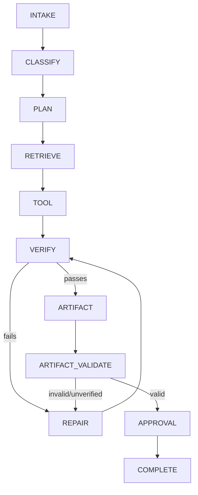
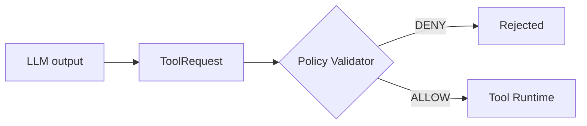
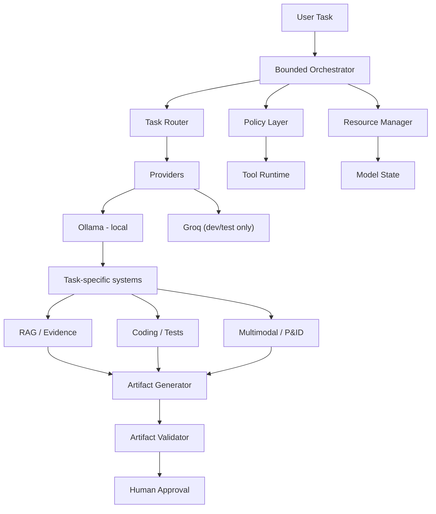
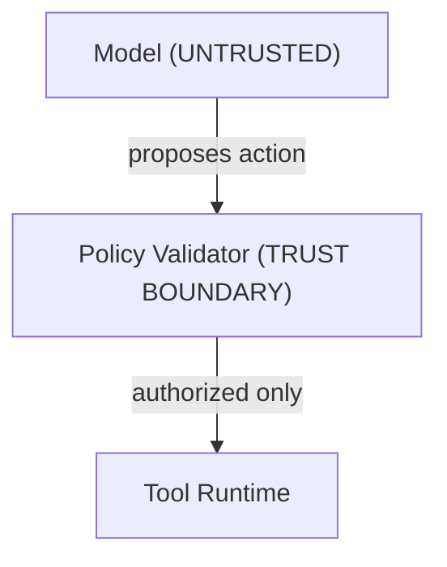

# Indigent

**A sovereignty-first, self-hosted agentic AI workbench for industrial engineering work that can't leave the building.** Every model action gets proposed, checked against policy, run through tools, and verified before it becomes an approved artifact.

Built for **Smart India Hackathon 2026 · Problem Statement 26117**.

Status: Real-mode control plane, local Ollama inference, model routing and residency tracking, production RAG ingestion/retrieval, grounded answer generation and citation verification, P&ID pipeline integration, artifact validation, calculations/provenance handling, and sovereignty telemetry are implemented and tested. Live validation has confirmed Qwen3 14B local generation, document-scoped retrieval, grounded answers, citation verification, and air-gapped operation. Remaining work is focused on full artifact/tool workflows, multimodal runtime dependencies, frontend/API integration, and final demo hardening.

[Why Indigent](#why-indigent) · [How it works](#core-principles) · [Quick start](#quick-start) · [Architecture](#architecture) · [Status](#current-development-status) · [Roadmap](#roadmap) · [Contributing](#contributing)

---

## Why Indigent

Companies need to keep sensitive data in-house: inspection reports, P&IDs, specs, maintenance logs, calculations, scripts, compliance docs. Most AI workflows assume that data can leave the building. Indigent doesn't. **Your data stays inside your own infrastructure.** Any exception is a config setting you choose explicitly, not a hidden fallback.

Indigent is more than a local LLM wrapper. It's a control plane between the model and the tools it uses. Upgrading the model doesn't automatically give it more permissions.

## Core principles

### 1. Sovereignty by construction

```bash
INFERENCE_MODE=local
```

Local mode has no silent fallback to a cloud provider. Groq is available as a sanctioned dev/testing option, kept separate from the default path. The shipped and demo configuration runs on local Ollama.

The platform exposes sovereignty as a live runtime state, including the active inference mode, provider, external-call counters, and network policy:

```text
AIR-GAPPED
External API Calls: 0
Internet: BLOCKED
Inference: LOCAL
```

vs. explicitly:

```text
EXTERNAL INFERENCE ACTIVE
Network: ALLOWED TO PROVIDER ENDPOINT
```

### 2. Bounded autonomy

The agent runs through a fixed state machine with defined timeouts, authorization checks, and capped repair attempts at each stage:



### 3. Policy-controlled execution

We treat model output as an **untrusted proposal**, never a trusted instruction. Every tool request has to clear a deterministic policy validator before it reaches the execution runtime. The model can't authorize its own actions.



### 4. Evidence before confidence

We track where every piece of evidence came from instead of just returning similar-looking text chunks. Each piece of evidence carries a document ID, chunk ID, source hash, page/section reference, and retrieval/rerank scores, so it can be traced back to its source:

```
Document → Chunk → Evidence → Claim → Verification → Artifact
```

### 5. Verification is a first-class step

Nothing is trusted by default. We verify citations, evidence chains, math, code execution and tests, and artifact structure and semantics. If a check fails, we attempt repair and re-verify, up to three times. If something still can't be verified, it's recorded as **`UNVERIFIED`** instead of marked as passing.

---

## Architecture



### Security boundary

We treat the model as an untrusted decision-maker, never a trusted execution engine.



Other security properties: fail-closed validation, workspace confinement, path-traversal prevention, bounded file sizes, explicit tool allowlists, bounded retries, deterministic verification, no hidden provider fallback, provider isolation, and no credentials in model prompts or logs.

---

## Quick start

The repo contains the real-mode application composition, local Ollama inference, Qdrant-backed RAG, grounded verification, artifact validation, and the bounded agent control plane.

```bash
# Install dependencies
uv sync

# Start Qdrant
docker compose up -d qdrant

# Start the API
uv run uvicorn app.main:app --reload

# Run the test suite
uv run pytest -q

# Static compilation check
uv run python -m compileall app tests
```

The local demo configuration uses Ollama for inference. The default generation model on the Mac Apple Silicon profile is `qwen3:14b`; `qwen3.8-27b-abliterated:latest` remains available as an alternate local model. Embeddings use `embeddinggemma:latest` with a 768-dimensional Qdrant collection.

Production/demo execution uses `INFERENCE_MODE=local`. Groq remains an explicitly configured development/testing provider and is never used as a silent fallback.

---

## What's implemented

| Layer | Capabilities |
|---|---|
| **Inference & model control** | Provider abstraction, local Ollama provider, explicit Groq dev/test provider, health checks, explicit inference modes, model registry, task-aware routing, hardware-profile-aware selection, model residency synchronization with Ollama, resource-aware selection, `ModelUnavailableError`, no silent cross-mode fallback |
| **Resource management** | Model residency tracking, Ollama `/api/ps` synchronization, active-request tracking, memory requirements, bounded concurrency, load/unload lifecycle hooks, hardware-aware resource checks |
| **Bounded orchestration** | Explicit execution states, dynamic planning, task classification, retrieval integration, tool boundaries, verification, bounded repair, human approval, hard task/model/tool timeouts |
| **Policy validation** | Task/tool authorization, allowlists, argument validation, unexpected-field rejection, path-traversal and absolute-path rejection, workspace boundary enforcement, file type/size limits, fail-closed behavior |
| **RAG & evidence** | Document ingestion, source hashing, deterministic chunking, stable chunk IDs, local Ollama embeddings, Qdrant vector storage, document-scoped retrieval, expanded candidate recall, cosine similarity + reranking, evidence metadata, provenance preservation, citation verification |
| **Citation verification** | Claim-vs-evidence checking, structured output validation, confidence + explanation recording, provenance preservation, bounded repair on verification failure |
| **Coding agent** | Generate → policy-validate → create → execute → test → deterministic verification → bounded repair, using exit codes/test results/runtime errors rather than asking an LLM if it worked |
| **Multimodal / P&ID** | Structured `PIDGraph` representation with nodes, edges, bounding boxes, confidence, overlay reference, narrative, graph validation, and image-capability-aware routing; OCR pipeline supports rendered-PDF OCR when Tesseract is available |
| **Artifact generation & validation** | DOCX/XLSX artifact generation, grounded findings, citation/evidence linkage, calculations with validated `name`/`formula`/`inputs`/`result` structure, deterministic semantic checks, provenance checks, SHA-256 artifact hashing, explicit `VALID`/`INVALID`/`UNVERIFIED` states |

Supported hardware profiles today: **Mac Apple Silicon**, and **Windows/Linux with an RTX 3050A 4GB**.

The default global repair bound is:

```text
MAX_REPAIR_ATTEMPTS = 3
```

There is no unbounded self-correction loop anywhere in the system.

---

## Current development status

The repo contains the Joy control-plane implementation, real-mode service composition, production local RAG path, grounded answer verification, model lifecycle/resource management, P&ID integration, artifact validation, and sovereignty telemetry. Live testing has also validated the Qwen3 14B generation path and air-gapped operation against a real ingested document.

**Implemented and tested**
- Inference provider abstraction, Ollama provider, explicit Groq dev/test provider
- Model registry and hardware-aware routing
- Ollama residency synchronization and resource-aware model selection
- Bounded orchestrator with verification and repair
- Deterministic policy validation and tool authorization
- Production Ollama embeddings + Qdrant RAG ingestion/retrieval
- Expanded retrieval candidate recall and document-scoped retrieval
- Evidence provenance and citation verification
- Coding verification and bounded repair
- P&ID graph pipeline integration
- Artifact semantic validation, provenance, and calculation handling
- DOCX/XLSX artifact generation paths
- Real-mode application composition and sovereignty telemetry
- Air-gapped local execution with zero external inference calls in local mode
- Control-plane integration and failure/security test coverage

**Remaining work**
- Complete physical tool/runtime integration across all supported workflows
- Finish multimodal runtime transport where a local vision model is required
- Full end-to-end artifact/demo acceptance workflow including human approval
- Frontend/API contract integration
- Remaining security/attack testing and demo hardening
- Environment-dependent OCR validation where Tesseract is required

We intentionally **fail closed** when production dependencies or adapters aren't configured, instead of silently substituting stubs or external services.

---

## Testing

```bash
uv run pytest -q
```

Current local baseline: 404 passed, 14 skipped, 3 deselected, with one Windows-specific hardware test requiring a Windows/compatible hardware environment. Focused RAG production tests report 15 passed, 1 skipped.

Coverage includes provider behavior, model routing and residency, resource management, orchestration, policy enforcement, RAG ingestion/retrieval, citation verification, coding verification, P&ID processing, artifact generation/validation, application wiring, and failure/security behaviors.

For live validation, the environment can exercise local Ollama generation, Qdrant retrieval, grounded-answer verification, artifact workflows, and sovereignty telemetry against real services.

---

## Project structure

```text
app/
├── agent/                 # orchestrator, router, registry, resource manager, state machine
│   ├── answer.py
│   ├── coding.py
│   ├── grounded_artifact.py
│   ├── orchestrator.py
│   ├── registry.py
│   ├── resource_manager.py
│   ├── router.py
│   └── state.py
├── api/                   # HTTP API routes
├── artifact_validation/   # structural and semantic artifact checks
├── contracts/             # shared interfaces and typed contracts
├── core/                  # task execution, persistence, and runtime helpers
├── deps.py                # service composition / dependency wiring
├── net/                   # network and egress controls
├── pid_ml/                # P&ID graph pipeline
├── policy/                # allowlists, schemas, policy validation
├── providers/              # Ollama/Groq provider implementations
├── rag/                   # extraction, OCR, chunking, embeddings, Qdrant, retrieval
├── runtime/                # runtime generators and artifact execution
└── stubs/                 # explicit test/development stubs

tests/
├── integration/
├── test_coding.py
├── test_orchestrator.py
├── test_policy.py
├── test_rag.py
├── test_rag_production.py
├── test_pid_pipeline.py
├── test_artifact_validation.py
└── ...
```

`app/rag/` now includes the production retrieval/embedding stack and should be treated as part of the implemented runtime rather than an unverified subtree.

For generated code, tool calls resolve to a validated contract of this shape:

```json
{
  "files": [
    { "path": "code/main.py", "content": "print('hello')" }
  ]
}
```

---

## Configuration

This documents the settings currently used by the implemented runtime.

| Variable | Required | Default | Description |
|---|---:|---|---|
| `INFERENCE_MODE` | Yes | — | `local` runs inference through Ollama with no cloud fallback; any external mode is explicitly configured for development/testing |
| `MODEL_INVENTORY_JSON` | No | environment-specific | JSON model registry used for task capability, hardware-profile, mode, and memory-aware routing |
| `EMBEDDING_BACKEND` | No | `ollama` | Local embedding backend used by the production RAG path |
| `EMBEDDING_MODEL` | No | — | Local embedding model; current validated model is `embeddinggemma:latest` |
| `EMBEDDING_VECTOR_SIZE` | No | — | Qdrant vector dimension; current validated collection uses `768` |
| `MAX_REPAIR_ATTEMPTS` | No | `3` | Global bound on orchestrator repair attempts before an `UNVERIFIED`/`INVALID` outcome |
| `MODEL_GENERATION_TIMEOUT_S` | No | environment-specific | Maximum generation time for a model call |
| `HARD_TASK_TIMEOUT_S` | No | environment-specific | Overall bounded task execution timeout |

---

## Roadmap

| Phase | Focus |
|---|---|
| **1 — Control plane** *(implemented)* | Provider abstraction, model routing, resource management, bounded orchestration, policy enforcement, verification, provenance |
| **2 — Runtime integration** *(implemented)* | Real local inference, service composition, RAG ingestion/retrieval, grounded verification, artifact generation/validation, tool/runtime integration, sovereignty telemetry |
| **3 — Multimodal** *(partially implemented)* | OCR pipeline, P&ID graph integration, image-capability-aware routing, local vision-model transport and full multimodal execution |
| **4 — Hardening** *(active)* | Security attack tests, egress validation, resource-exhaustion tests, prompt-injection tests, artifact tamper validation, frontend/API contract validation, and complete end-to-end demo acceptance |

---

## Contributing

Contributions are welcome as long as you don't break the security/sovereignty boundaries. Specifically, don't:

- introduce silent cloud fallbacks
- bypass policy validation
- let model output authorize tools
- add unrestricted agent loops
- weaken workspace/path isolation
- add external network dependencies to offline execution paths

Prefer deterministic validation over LLM-based validation wherever you can, and keep provenance intact whenever data moves through the system.

**Local setup:**

```bash
uv run pytest -q
uv run python -m compileall app tests
```

---

## License

License: TBD.

---

## Next step

Clone the repo, start the local services, run the test suite, and then exercise the real-mode workflow through the API. The current representative path is local Ollama inference with Qwen3 14B, document-scoped Qdrant retrieval, grounded citation verification, and artifact validation under the sovereignty monitor. Full end-to-end demo acceptance, multimodal runtime dependencies, frontend/API integration, and final hardening remain in progress.
