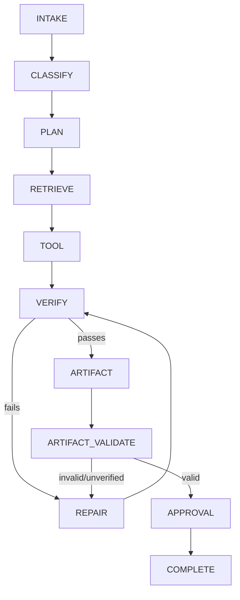
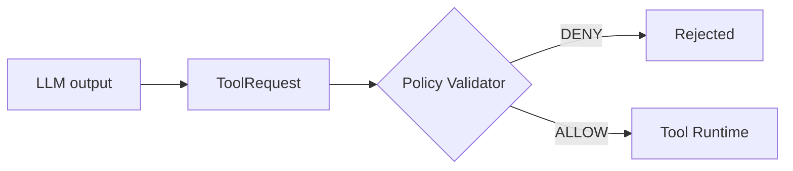
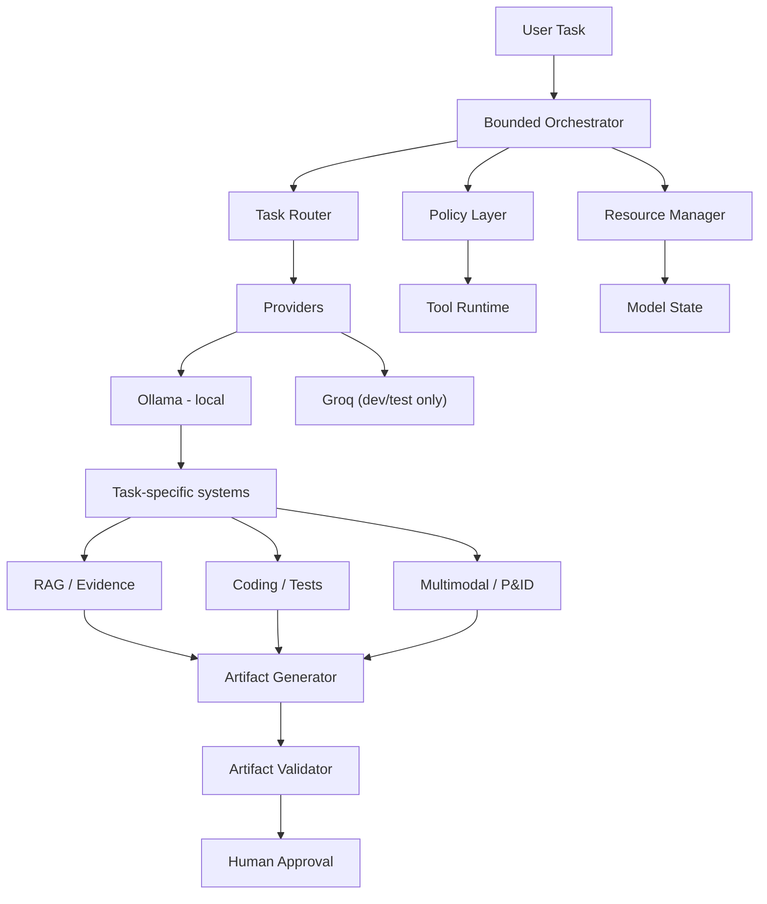
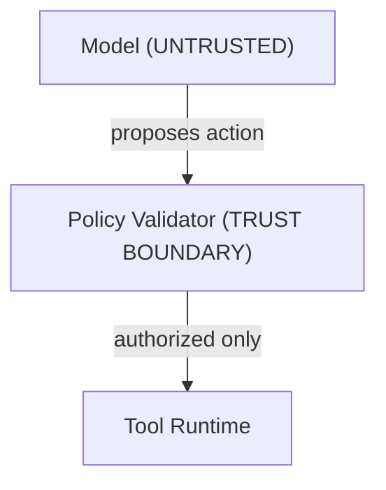

# Indigent

**A sovereignty-first, self-hosted agentic AI workbench for industrial engineering work that can't leave the building.** Every model action gets proposed, checked against policy, run through tools, and verified before it becomes an approved artifact.

Built for **Smart India Hackathon 2026 · Problem Statement 26117**.

Status: Core control plane, real-mode composition, RAG ingestion/retrieval, grounded answer verification, P&ID integration, and artifact validation are implemented and tested. End-to-end runtime integration and remaining multimodal/tooling work are in progress. See [Current development status](#current-development-status).

[Why Indigent](#why-indigent) · [How it works](#core-principles) · [Quick start](#quick-start) · [Architecture](#architecture) · [Status](#current-development-status) · [Roadmap](#roadmap) · [Contributing](#contributing)

---

## Why Indigent

Companies need to keep sensitive data in-house: inspection reports, P&IDs, specs, maintenance logs, calculations, scripts, compliance docs. Most AI workflows assume that data can leave the building. Indigent doesn't. **Your data stays inside your own infrastructure.** Any exception is a config setting you choose explicitly, not a hidden fallback.

Indigent is more than a local LLM wrapper. It's a control plane between the model and the tools it uses. Upgrading the model doesn't automatically give it more permissions.

## Core principles

### 1. Sovereignty by construction

```bash
INFERENCE_MODE=local
```

Local mode has no silent fallback to a cloud provider. Groq is available as a sanctioned dev/testing option, kept separate from the default path. The shipped and demo configuration runs on local Ollama.

The platform exposes sovereignty as a live runtime state, including the active inference mode, provider, external-call counters, and network policy:

```text
AIR-GAPPED
External API Calls: 0
Internet: BLOCKED
Inference: LOCAL
```

vs. explicitly:

```text
EXTERNAL INFERENCE ACTIVE
Network: ALLOWED TO PROVIDER ENDPOINT
```

### 2. Bounded autonomy

The agent runs through a fixed state machine with defined timeouts, authorization checks, and capped repair attempts at each stage:



### 3. Policy-controlled execution

We treat model output as an **untrusted proposal**, never a trusted instruction. Every tool request has to clear a deterministic policy validator before it reaches the execution runtime. The model can't authorize its own actions.



### 4. Evidence before confidence

We track where every piece of evidence came from instead of just returning similar-looking text chunks. Each piece of evidence carries a document ID, chunk ID, source hash, page/section reference, and retrieval/rerank scores, so it can be traced back to its source:

```
Document → Chunk → Evidence → Claim → Verification → Artifact
```

### 5. Verification is a first-class step

Nothing is trusted by default. We verify citations, evidence chains, math, code execution and tests, and artifact structure and semantics. If a check fails, we attempt repair and re-verify, up to three times. If something still can't be verified, it's recorded as **`UNVERIFIED`** instead of marked as passing.

---

## Architecture



### Security boundary

We treat the model as an untrusted decision-maker, never a trusted execution engine.



Other security properties: fail-closed validation, workspace confinement, path-traversal prevention, bounded file sizes, explicit tool allowlists, bounded retries, deterministic verification, no hidden provider fallback, provider isolation, and no credentials in model prompts or logs.

---

## Quick start

The repo ships the Joy control-plane implementation with real-mode composition, local RAG, grounded verification, artifact validation, and integration tests. Full product/UI workflows are still being completed.

```bash
# ⚠ placeholder — replace with the actual setup command from docs/demo-runbook.md
pip install -r requirements.txt   # or the project's declared dependency file

# Run the full test suite
pytest -q

# Static compilation check
python3 -m compileall -q app tests
```

Expected result: **347 tests passing, 14 skipped, 3 deselected** in the non-Docker suite. Live integration tests additionally exercise local Ollama and Qdrant when configured.

Local inference runs through [Ollama](https://ollama.com). Production config sets `INFERENCE_MODE=local`. Groq is only enabled deliberately, for development or testing.

---

## What's implemented

| Layer | Capabilities |
|---|---|
| **Inference & model control** | Provider abstraction, local Ollama provider, explicit Groq dev/test provider, health checks, explicit inference modes, model registry, task-aware routing, hardware-profile-aware selection, `ModelUnavailableError`, no silent cross-mode fallback |
| **Resource management** | Model residency tracking, active-request tracking, memory requirement config, bounded concurrency, load/unload hooks — no fabricated GPU telemetry |
| **Bounded orchestration** | Explicit execution states, dynamic planning hooks, task classification, retrieval integration, tool boundaries, verification, bounded repair, human approval, hard task/model/tool timeouts |
| **Policy validation** | Task/tool authorization, allowlists, argument validation, unexpected-field rejection, path-traversal and absolute-path rejection, workspace boundary enforcement, file type/size limits, fail-closed behavior |
| **RAG & evidence** | Document ingestion, source hashing, deterministic chunking, stable chunk IDs, Ollama embeddings, Qdrant vector storage, scoped retrieval, cosine similarity + reranking, evidence metadata, provenance preservation, and citation verification |
| **Citation verification** | Claim-vs-evidence checking, structured output validation, confidence + explanation recording, provenance preservation, triggers bounded repair on failure |
| **Coding agent** | Generate → policy-validate → create → execute → test → deterministic verification → bounded repair, using exit codes/test results/runtime errors rather than asking an LLM if it worked |
| **Multimodal / P&ID** | Structured `PIDGraph` representation (nodes, edges, bounding boxes, confidence, overlay reference, narrative), graph validation for stable IDs, unique nodes, valid edges, confidence bounds |
| **Artifact validation** | Structural + semantic checks, claim/evidence linkage, citation validation, deterministic calculation checks, provenance checks, SHA-256 artifact hashing, explicit `VALID` / `INVALID` / `UNVERIFIED` states |

Supported hardware profiles today: **Mac Apple Silicon**, and **Windows/Linux with an RTX 3050A 4GB**.

The default global repair bound is:

```text
MAX_REPAIR_ATTEMPTS = 3
```

There is no unbounded self-correction loop anywhere in the system.

---

## Current development status

The repo contains the Joy control-plane implementation, real-mode service composition, production RAG path, grounded answer verification, P&ID integration, artifact validation, and integration tests. Full product workflows remain under active development.

**Implemented and tested**
- Inference provider abstraction, Ollama provider, Groq dev/test provider
- Model registry and hardware-aware routing
- Resource manager and bounded concurrency
- Bounded orchestrator with verification and repair
- Deterministic policy validation and tool authorization
- Production Ollama embeddings + Qdrant RAG ingestion/retrieval
- Evidence provenance and citation verification
- Coding verification and bounded repair
- P&ID graph pipeline integration
- Artifact semantic validation and provenance checks
- Real-mode application composition and sovereignty telemetry
- Control-plane integration and failure/security test coverage

**In progress**
- Remaining physical tool implementations and runtime integrations
- OCR/document-processing integration
- Full multimodal provider transport
- Complete artifact-generation workflows
- Frontend/API contract integration
- Remaining security/attack testing
- End-to-end demo hardening and acceptance matrix completion

We intentionally **fail closed** when production dependencies or adapters aren't configured, instead of silently substituting stubs or external services.

---

## Testing

```bash
pytest -q
```

The current non-Docker test baseline is **347 passed, 14 skipped, 3 deselected**. Step 10 currently reports **22 passed, 3 skipped**. Coverage includes provider behavior, routing, resource management, orchestration, policy enforcement, RAG ingestion/retrieval, citation verification, coding verification, P&ID processing, artifact validation, application wiring, and failure/security behaviors.

---

## Project structure

```text
app/
├── agent/                 # orchestrator, router, registry, resource manager, state machine
│   ├── coding.py
│   ├── orchestrator.py
│   ├── registry.py
│   ├── resource_manager.py
│   ├── router.py
│   └── state.py
├── artifact_validation/
│   └── validator.py
├── policy/
│   ├── allowlist.py
│   ├── schemas.py
│   └── validator.py
├── providers/
│   ├── base.py
│   ├── groq.py
│   ├── http.py
│   ├── ollama.py
│   └── types.py
├── rag/                   # ⚠ unverified — needs sync against the actual app/rag/ tree, see note below
│   ├── chunking.py
│   ├── extractors.py
│   ├── interfaces.py
│   ├── models.py
│   ├── retrieval.py
│   ├── store.py
│   └── verification/
└── pid_ml/
    ├── models.py
    └── pipeline.py

tests/
├── integration/
├── test_coding.py
├── test_orchestrator.py
├── test_policy.py
├── test_rag.py
├── test_pid_pipeline.py
├── test_artifact_validation.py
└── ...
```

> **Note:** the `rag/` subtree above is the last version I could confirm and is flagged as possibly stale — it now includes production Ollama/Qdrant integration per the updates above, which likely means new files (embeddings, Qdrant client, etc.) that aren't reflected in this listing. Paste the output of `find app/rag -type f` (or similar) and I'll sync it exactly, without guessing at filenames.

For generated code, tool calls resolve to a validated contract of this shape:

```json
{
  "files": [
    { "path": "code/main.py", "content": "print('hello')" }
  ]
}
```

---

## Configuration

This only documents settings that currently exist. The table will grow as production wiring lands.

| Variable | Required | Default | Description |
|---|---:|---|---|
| `INFERENCE_MODE` | Yes | — | `local` runs inference through Ollama with no cloud fallback; any external mode is an explicit, separately-configured development/testing path |
| `MAX_REPAIR_ATTEMPTS` | No | `3` | Global bound on how many times the orchestrator will attempt bounded repair before surrendering to an `UNVERIFIED`/`INVALID` result |

---

## Roadmap

| Phase | Focus |
|---|---|
| **1 — Control plane** *(implemented)* | Provider abstraction, model routing, resource management, bounded orchestration, policy enforcement, verification, provenance |
| **2 — Runtime integration** *(current)* | Real local inference, service composition, RAG ingestion/retrieval, grounded verification, artifact workflows, tool/runtime integration, sovereignty telemetry |
| **3 — Multimodal** *(in progress)* | OCR, image transport, production multimodal inference, P&ID execution integration, structured graph extraction, multimodal verification |
| **4 — Hardening** | Security attack tests, network-egress validation, resource exhaustion tests, prompt-injection tests, artifact tamper validation, frontend/API contract validation, and end-to-end demo workflows |

---

## Contributing

Contributions are welcome as long as you don't break the security/sovereignty boundaries. Specifically, don't:

- introduce silent cloud fallbacks
- bypass policy validation
- let model output authorize tools
- add unrestricted agent loops
- weaken workspace/path isolation
- add external network dependencies to offline execution paths

Prefer deterministic validation over LLM-based validation wherever you can, and keep provenance intact whenever data moves through the system.

**Local setup:**

```bash
pytest -q
python3 -m compileall -q app tests
```

---

## License

License: TBD.

---

## Next step

Clone the repo, run `pytest -q`, and read through `app/agent/orchestrator.py` and `app/policy/validator.py`. That's the fastest way to see the propose, policy, execute, verify loop in actual code instead of in diagrams.
